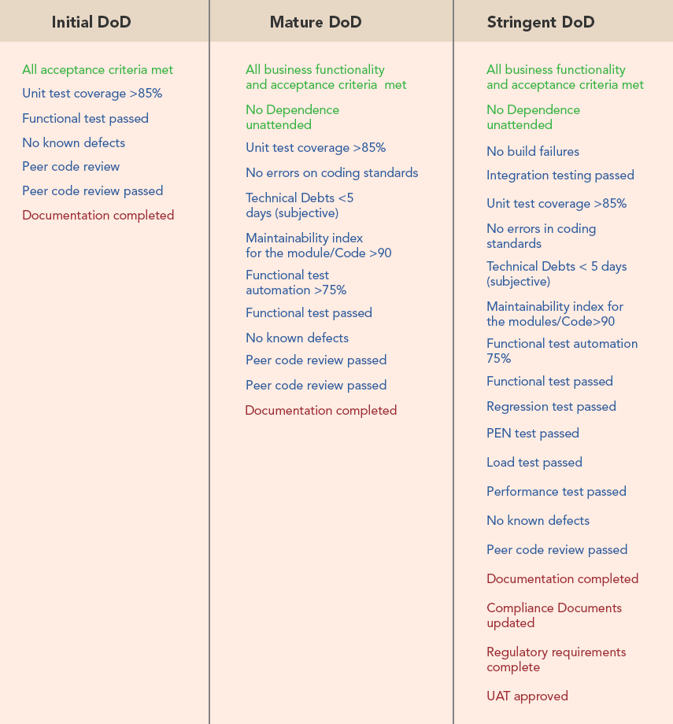

Many years ago I struggled with tickets and how to use them. How do I structure the tickets and how do I write them correctly so that everyone agrees with them and most importantly, to answer the question "when is it done?".

Over the years, a lot of good ideas have come from different sources and I've tried to glue them together into a digestible document.

So what I'm trying to cover are:

- **Tickets** and how to structure them
- **User stories & acceptance criteria** and how to write them
- **Definition of Done** and how to find the right one

## Tickets

First there are two question to answer. I bet every team has different ones but here are some of mine:

### Why we write tickets?

- So if we get sick, a teammate can help us out
- To help us decompose our work into small pieces
- As a placeholder for a real-life conversation
- To keep track of how we resolved the issue
- To make our stand-ups effective
- To point out dependencies and possible blockers
- To reflect on the mix/makeup of our work during retros
- Self-discipline. Don’t take on too much. Try to do one thing at a time

### Why we DON’T write tickets?

- To track our time
- To compete with other team members
- To show managers we’re busy
- To make managing people possible
- To report status, or % complete
- Because the ticket software is fun to use
- External discipline

### Tickets

So how do we structure them? What kind of ticket reflects the big picture and what goes into detail?

#### Theme

Themes are a collection of User Stories (by category). By its nature, an Epic can also be a Theme in itself.

### Epic

You can see them as big user stories that need to be "split" into smaller pieces (Stories). They should be reflected in the product roadmap.

#### Story (not User Story)

Stories describe a specific user benefit (a requirement or feature) in tickets. It is the smallest unit of a User Story (as defined below).

#### Subtask

Use subtasks to split stories or tasks into smaller chunks. Useful to break down a lot of work into smaller pieces, which can help with estimates, or to figure out what can be worked on in parallel. Usually subtasks don’t need a detailed description, instead the parent tickets should have most of the details.

In my opinion the size of a sub ticket should be about the size of a working day if possible and is _good reviewable_.

#### Task

Task tickets can be used for any effort that is neither fixing a bug (use bug tickets) nor implementing a new feature (use user stories and subtasks).

For example, measuring page loading time to find opportunities for optimizations could be a task ticket.

So this type of ticket are ideal for research or so called [Spikes](https://www.leadingagile.com/2016/09/whats-a-spike-who-should-enter-it-how-to-word-it/)

#### Bug

Bug tickets should only be used for issues that are observable to customers. This applies to issues with any impact. The higher the impact (more affected customers, higher risk to the company) the higher the priority to fix the bug.

Don’t use bug tickets for issues in new features that are behind feature flags.

## User Stories

### What are User Stories

Sometime other words are better than your own and the good people from Atlassian nailed it:

> A User Story is the smallest unit of work in an agile framework. It’s an end goal, not a feature, expressed from the software user’s perspective.

> A User Story is an informal, general explanation of a software feature written from the perspective of the end user or customer.

> User Stories are a few sentences in simple language that outline the desired outcome. They don't go into detail. Requirements are added later, once agreed upon by the team.

Source: [User Stories with Examples and Template](https://www.atlassian.com/agile/project-management/user-stories)

### Why create user stories

#### Focus, Testability

User Stories keep the focus on the humans we are working for. As they are written in a simple language, it enables collaboration with other non-technical or less technical team members like designers or testers and removes complexity and improves common understanding of a user story.

#### High level

It also supports the best solution for a problem, since no technical specifications are made. It's up to the team how to implement the user story.

#### Estimate, size and value

User Stories are usually easy to estimate and can be easily planned because a user story is a small unit and should be doable in a certain amount of time which delivers a value to end users.

#### Team climate

User Stories are also good for the team climate, as they are usually well defined and clear before they are actually implemented. This prevents loops in the workflow and increases motivation and is therefore a win-win situation for all team members and beyond.

### Working with User Stories (the most important part)

Generally a user story is written by the product owner and the team reviews these stories during the refinement session. Requirements are discussed,missing ones added, unclear ones improved.

The team now has the option of adding more implementation details within subtasks so that everyone knows what needs to be done and can commit to it.

Once each ticket is completed, the team can also additionally estimate its complexity. They can use T-shirt sizes, the Fibonacci sequence, or other units to provide reliable planning.

### User Story template and examples

A User Story is just a simple sentence and could look like:

In order to `<benefit>` as a `<role>`, I can `<goal/desire>`

- The `<benefit>` is the solution of a problem or the reason why the persona is doing it. It is the general result of a story that the persona receives.

- The `<role>` is the [persona](<https://en.wikipedia.org/wiki/Persona_(user_experience)>) who the team is building it for. Everyone within the team has to know who this persona is.

- The `<goal/desire>` is the intent of the specific persona. Its description should be non-specific and should not describe the used feature or implementation details. For short it is a neutral statement.

For example they can look like:

In order to **celebrate my birthday**
as a **birthday child**,
I can **invite all my friends and their friends**.

In order to **get a new pair of shoes**
as a **customer**,
I can **order them in the shop**.

In order to **avoid errors**
as a **developer**,
I can **check the code automatically**.

In order to **sign up**
As an **unauthorized user**
I can **fill out a sign up form**

This is heavily inspired by the [gherkin syntax](https://docs.behat.org/en/v2.5/guides/1.gherkin.html#gherkin-syntax).

## Acceptance criteria

### What are acceptance criteria

Acceptance criteria are used within user stories to validate whether a story has been completed and the feature works as expected.

Acceptance criteria are conditions that a product must meet in order to be accepted by a human or the system using it.

Acceptance criteria consist of a set of specifications and each specification contains a clear result of passing or failing. The statements specify both functional and non-functional requirements and are relevant for epics, features, and the story itself. Acceptance criteria are also part of the "Definition of Done".

### When do you define acceptance criteria?

The definition of acceptance criteria should be done before product development. Otherwise it is only a checklist for the functionality and does not meet the expectations of the user. It is more important to know what the user needs and to take the perspective of the user before starting the implementation and estimation.

### Working with acceptance criteria

Acceptance criteria should aim to be as comprehensive as possible, as a reference to designers (what aspects does the design have to include), implementers (what to implement) and testers (what to test for).

They should be part of the user story and not duplicated across multiple tickets, so that updates can be applied in a single location. Accordingly, during all phases acceptance criteria should be kept up to date, as team members learn more about the actual requirements.

### What should good acceptance criteria look like?

Acceptance criteria define when a user story is complete and works as expected. The criteria should be written clearly and concisely, in simple language that is understood by any human and it should be without ambiguity to avoid misinterpretation.

This allows the actual implementation and the creation of automated tests to benefit while they are part of the continuous integration.

#### Example

##### User story

In order to **save time and paper**
as **a conference participant**
I can **register online with a sign up form**

##### Acceptance criteria

- The user is only able to submit the sign up form after filling out the necessary fields.
- All information from the form is stored in the registration database.
- The user is able to pay via credit card.
- The user receives a confirmation email after the form has been submitted.

### What is the overall picture

In combination user story sentence and acceptance criteria complete the user story description and you add subtasks to define the implementational details.

As this is the essential content of an user story you can add context if necessary to be more precise about what should be done. In special cases it is helpful to mention the big picture or add a link to a description of an epic, vision or something that helps all participants to understand what the story is about.

For example in Jira this could look like this:

## Definition of Done

### What is a “Definition of Done”

In short, DoD (for short) is a shared understanding within the team on what it takes to make your product increment described in a User Story releasable. So

> “Done” means “releasable”!

### Why do we need a DoD

It lowers rework, by preventing User Stories that don’t meet the definition from being delivered to the next level (for example quality assurance or stakeholders). So features that don’t match the DoD will not be delivered to a customer.

Having an explicit contract of what “Done” means limits the risk of misunderstanding and conflicts between the development team and the product owner.

For new colleagues it is a useful guide to understand the process of a User Story.

### How do you define a DoD

There are three categories which defines a part of the DoD:

- Business or functional requirements
- Non-functional requirements
- High Quality

#### Functional requirements

The product increment must meet all defined requirements for the User Story to be "done".

#### High Quality

Quality is owned by the Development Team to ensure that the product is of the maximum quality. These quality standards can be subjective, and also data-driven.

##### Examples

- Defined coding standards (via ESLint for example)
- Test Driven Development
- Test coverage
- Maintainability Index
- No defects / Known defects
- No side effects
- Low technical debt
- Design principles

#### Non-Functional Requirements

These are the standard characteristics or attributes of the product that might not add direct business value, but without them the product would be incomplete.

##### Examples

- Availability
- Maintainability
- Performance
- Reliability
- Scalability
- Security
- Usability
- Accessibility
- Compliance / Regulatory
- Legal

Source: [https://www.scrum.org/resources/blog/done-understanding-definition-done](https://www.scrum.org/resources/blog/done-understanding-definition-done)

### So what is the result?

First of all this is just a draft or inspiration for a possible workflow. It is not carved in stone (and should never be), so hold your horses and feel free to modify or extend at any time. Maybe in your next Retro someone has a good idea?

These “checklist items” are not assigned to a specific role. Everyone within the team has the responsibility to check if all the criteria are met.

So

> The whole team is responsible to check if everthing's done. Not only a tester or the product owner or the one who wrote it.

There may be some differences between front and back end, like manual browser testing, automated regression testing or accessibility testing, so keep in mind:

> Obsessing over the list of criteria can be counter-productive; the list needs to define the minimum work generally required to get a product increment to the “done” state

Source: [https://www.agilealliance.org/glossary/definition-of-done/](https://www.agilealliance.org/glossary/definition-of-done/)

#### All acceptance criteria are met

All requirements in a ticket are met and all sub tasks are completed.

#### Test coverage reached

All functions and classes are covered by tests. In order to provide a high quality standard the test coverage should reach 80%.

#### Build pipeline passed

The build pipeline successfully runs through. All stages are “green” and not “flaky”. This includes unit, integration and e2e tests as well code style checks.

#### Code Review passed

A developer not involved in the implementation has checked that all acceptance criteria are met. For tickets or bugs of low complexity or in pair programming, a quick review may be sufficient.

#### Code merged and main pipeline passed

The merge request was successfully merged without conflicts after the approval of a developer who reviewed the code. The related branch was deleted and all necessary fixtures (databases, review related testing data) were cleaned up.

#### Ticket status is correct

The ticket was set to the correct status and a solution version was entered. If necessary, useful notes for QA were added to the ticket.

#### Changelog is updated

The changelog of the recently added product increment is documented for the next release.

#### Changes are deployed

The changes are deployed to stage for testing and QA is informed to test the acceptance criteria.

#### Breaking changes are visible to all teams

Breaking changes are broadcasted to all teams. Direct dependencies of all kinds are documented.

## Verdict

It's done when it's done but it is not always easy to define this in a clear way for everyone.

We need well-written tickets with clear criteria and a shared understanding of the anatomy of a ticket and the context in which it resides.

Once the mindset of the entire team has mastered these administrative basics and learned the structure, you can get down to the nitty-gritty of developing software.

We focus on creating great software that brings joy to our users.
