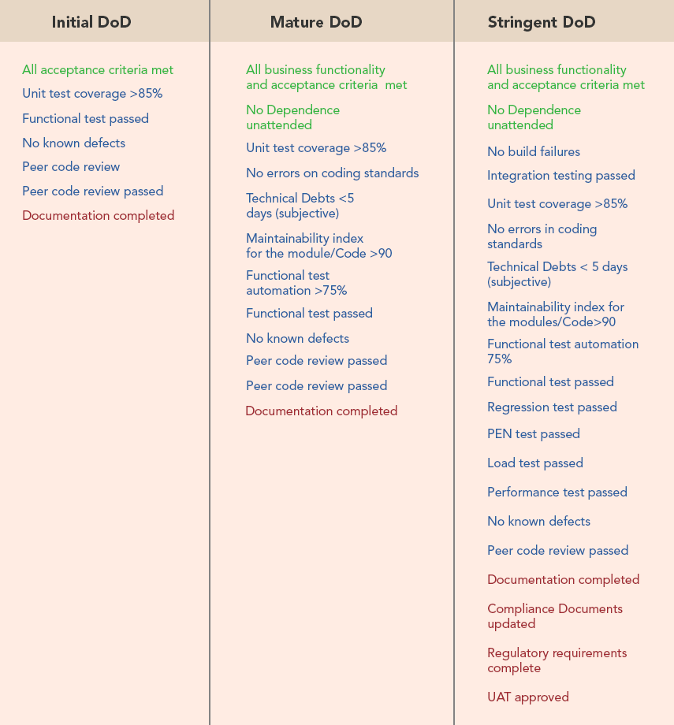

## What is a “Definition of Done”?

In short, DoD (for short) is a shared understanding within the team on what it takes to make your product increment described in a User Story releasable. So

> “Done” means “releasable”!

## Why do we need a DoD?

It lowers rework, by preventing User Stories that don’t meet the definition from being delivered to the next level (for example quality assurance or stakeholders). So features that don’t match the DoD will not be delivered to a customer.

Having an explicit contract of what “Done” means limits the risk of misunderstanding and conflicts between the development team and the product owner.

For new colleagues it is a useful guide to understand the process of a User Story.

## How do you define a DoD?

There are three categories which defines a part of the DoD:

- Business or functional requirements
- Non-functional requirements
- High Quality

### Functional requirements

The product increment must meet all defined requirements for the User Story to be "done".

### High Quality

Quality is owned by the Development Team to ensure that the product is of the maximum quality. These quality standards can be subjective, and also data-driven.

#### Examples

- Defined coding standards (via ESLint for example)
- Test Driven Development
- Test coverage
- Maintainability Index
- No defects / Known defects
- No side effects
- Low technical debt
- Design principles

### Non-Functional Requirements

These are the standard characteristics or attributes of the product that might not add direct business value, but without them the product would be incomplete.

#### Examples

- Availability
- Maintainability
- Performance
- Reliability
- Scalability
- Security
- Usability
- Accessibility
- Compliance / Regulatory
- Legal

Source: [https://www.scrum.org/resources/blog/done-understanding-definition-done](https://www.scrum.org/resources/blog/done-understanding-definition-done)

## So what is the result?

First of all this is just a draft or inspiration for a possible workflow. It is not carved in stone (and should never be), so hold your horses and feel free to modify or extend at any time. Maybe in your next Retrospective someone has a good idea.

These “checklist items” are not assigned to a specific role. Everyone within the team has the responsibility to check if all the criteria are met.

So

> The whole team is responsible to check if everthing's done. Not only a tester or the product owner or the one who wrote it.

There may be some differences between front and back end, like manual browser testing, automated regression testing or accessibility testing, so keep in mind:

> Obsessing over the list of criteria can be counter-productive; the list needs to define the minimum work generally required to get a product increment to the “done” state

Source: [https://www.agilealliance.org/glossary/definition-of-done/](https://www.agilealliance.org/glossary/definition-of-done/)

### All acceptance criteria are met

All requirements in a ticket are met and all sub tasks are completed.

### Test coverage reached

All functions and classes are covered by tests. In order to provide a high quality standard the test coverage should reach 80%.

### Build pipeline passed

The build pipeline successfully runs through. All stages are “green” and not “flaky”. This includes unit, integration and e2e tests as well code style checks.

### Code Review passed

A developer not involved in the implementation has checked that all acceptance criteria are met. For tickets or bugs of low complexity or in pair programming, a quick review may be sufficient.

### Code merged and main pipeline passed

The merge request was successfully merged without conflicts after the approval of a developer who reviewed the code. The related branch was deleted and all necessary fixtures (databases, review related testing data) were cleaned up.

### Ticket status is correct

The ticket was set to the correct status and a solution version was entered. If necessary, useful notes for QA were added to the ticket.

### Changelog is updated

The changelog of the recently added product increment is documented for the next release.

### Changes are deployed

The changes are deployed to stage for testing and QA is informed to test the acceptance criteria.

### Breaking changes are visible to all teams

Breaking changes are broadcasted to all teams. Direct dependencies of all kinds are documented.

## Verdict

It's done when it's done but it is not always easy to define this in a clear way for everyone.

So we start small and grow as the project grows.

It'll take some time to get use to it but in the long shot it is worth it.

## Related article:

- [About stories and tickets](/blog/about-stories-and-tickets/)
