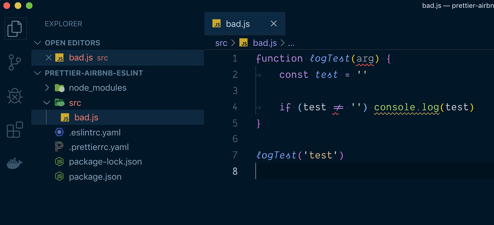

## What is Prettier and Airbnb’s ESlint configuration

Airbnb ESLint configuration is one of the most used ESLint configuration and Prettier is an opinionated code formatter with a handful options.

Both are very strong tools to make your code more readable, increases your code quality with consistency and prevents you from some serious mistakes in your code.

## Adding modules

Make a directory, step into it, just initialise your project with npm init and install ESLint and Prettier along with a Prettier config and plugin for ESLint

```shell
$ npm install -D eslint prettier eslint-config-prettier eslint-plugin-prettier

-   prettier@1.18.2
-   eslint@6.1.0
-   eslint-plugin-prettier@3.1.0
-   eslint-config-prettier@6.0.0
    added 125 packages from 79 contributors and audited 182 packages in 7.427s
    found 0 vulnerabilities
```

Additionally you need the Airbnb ESLint configuration with its peer dependecies. Here I am using [install-peerdeps](https://github.com/nathanhleung/install-peerdeps) from Nathan H. Leung.

```shell
$ npx install-peerdeps --dev eslint-config-airbnb-base
install-peerdeps v1.10.2
Installing peerdeps for eslint-config-airbnb-base@latest.
npm install eslint-config-airbnb-base@14.0.0 eslint@6.1.0 eslint-plugin-import@^2.18.2 --save-dev

npm WARN prettier-airbnb-eslint@1.0.0 No description
npm WARN prettier-airbnb-eslint@1.0.0 No repository field.

+ eslint-config-airbnb-base@14.0.0
+ eslint@6.1.0
+ eslint-plugin-import@2.18.2
added 61 packages from 36 contributors, removed 4 packages and updated 13 packages in 34.749s
SUCCESS eslint-config-airbnb-base
  and its peerDeps were installed successfully.
```

## Configure files

I am using .yaml-files for the configuration so create a .prettierrc.yaml and a .eslintrc.yaml. If you are using a \*nix-like system just put this in your console:

```shell
$ echo "---
extends:
  - airbnb-base
  - prettier
plugins:
  - prettier
rules:
  prettier/prettier:
    - error" >> .eslintrc.yaml
```

This extends the Airbnb "base" rules (this is the one without react plugins) along with the prettier rules. In this case the prettier rules overrides the formatting rules of the Airbnb rule set.

We don't use prettier directly but through eslint. That is why I added "prettier" as a plugin. And finally I added

```shell
$ echo "---
trailingComma: 'es5'
printWidth: 100
tabWidth: 4
useTabs: true
semi: false
singleQuote: true" >> .prettierrc.yaml
```

This is my personal configuration of prettier. Feel free to edit these for your project.

Now add two npm run scripts with [json](https://github.com/trentm/json) from Trent Mick.

```shell
$ npx json -I -f package.json -e 'this.scripts.lint="eslint --ext .js src"'
npx: installed 1 in 0.89s
json: updated "package.json" in-place
```

You can run now your “linting” with npm run lint and find your errors.

```shell
$ npx json -I -f package.json -e 'this.scripts.fix="npm run lint -- --fix"'
npx: installed 1 in 0.926s
json: updated "package.json" in-place
```

This will “fix” and format your code with npm run fix. The “fix” script won’t fix your entire code (see Fixing problems in the ESLint documentation) but the most common things.

## Try out your configuration

Add a really bad JavaScript file to your project:

```shell
$ mkdir src; echo "            function logTest (arg) {
const test =             \"\";

        if (test !=        \"\")
                console.log(test);

}

logTest('test');
" >> src/bad.js
```

And run npm run fix and you should see something like this:

```shell
$ npm run lint

> prettier-airbnb-eslint@1.0.0 lint /Users/dooz/projects/prettier-airbnb-eslint
> eslint --ext .js src

/Users/dooz/projects/prettier-airbnb-eslint/src/bad.js
  1:1   error    Replace `············function·logTest·` with `function·logTest`                                                         prettier/prettier
  1:31  error    'arg' is defined but never used                                                                                         no-unused-vars
  2:1   error    Replace `const·test·=·············"";` with `↹const·test·=·''`                                                          prettier/prettier
  4:1   error    Replace `········if·(test·!=········"")⏎················console.log(test);⏎` with `↹if·(test·!=·'')·console.log(test)`  prettier/prettier
  4:18  error    Expected '!==' and instead saw '!='                                                                                     eqeqeq
  5:17  warning  Unexpected console statement                                                                                            no-console
  9:16  error    Delete `;⏎`                                                                                                             prettier/prettier

✖ 7 problems (6 errors, 1 warning)
  4 errors and 0 warnings potentially fixable with the `--fix` option.
```

Wow... that worked! Now we try the fix feature of eslint.

```shell
$ npm run fix

> prettier-airbnb-eslint@1.0.0 fix /Users/dooz/projects/prettier-airbnb-eslint
> npm run lint -- --fix

> prettier-airbnb-eslint@1.0.0 lint /Users/dooz/projects/prettier-airbnb-eslint
> eslint --ext .js src "--fix"

/Users/dooz/projects/prettier-airbnb-eslint/src/bad.js
  1:18  error    'arg' is defined but never used      no-unused-vars
  4:11  error    Expected '!==' and instead saw '!='  eqeqeq
  4:18  warning  Unexpected console statement         no-console

✖ 3 problems (2 errors, 1 warning)
```

And the bad.js is not too bad anymore because Prettier and ESLint took care of it:

```javascript
function logTest(arg) {
  const test = '';

  if (test != '') console.log(test);
}

logTest('test');
```

In VS Code you need to install the eslint extension and you will see something like this:



That’s it. If you have any suggestion or questions, just tweet me.
